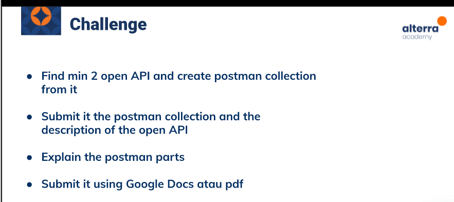

# (14) Pengenalan RESTful API

## Resume 

Dalam Materi ini, mempelajari :
1. API dan RESTful API 
2. Testing API
3. Advantages and Challenges

### API dan RESTful API
Application Programming Interface ( API ) berperan menerima permintaan dari sisi client dan memberitahu sistem apa yang harus dilakukan dengan memberikan respon yang sesuai permintaan tersebut.

REST merupakan singkatan dari Representational State Transfer. Standar arsitektur komunikasi yang digunakan dalam layanan berbasis web. Umumnya menggunakan HTTP sebagai protokol untuk komunikasi data. Menggunakan HTTP Method. Terdapat 4 HTTP Method yaitu :

1. GET (Membaca data)
2. PUT (Membuat/Mengganti Data)
3. POST (Membuat Data Baru)
4. DELETE (Menghapus data yang ada)

REST API komponen :
1. Method
2. URL
3. Header
4. Body

### Testing API
API Testing adalah testing yang dilakukan pada layer dimana API yang didesain untuk berkomunikasi pada aplikasi dipastikan fungsional test nya melalui rangkaian test.
Tujuannya adalah meluaskan cakupan dan test sedini mungkin dimana UI masih belum sepenuhnya siap untuk di test.

Macam-macam API Testing :
1. Functionality (Validasi fitur)
2. Load Test (menguji kekuatan sistem)
3. Security (keamanan sistem)

API Testing Tools :
1. Postman
2. APACHE JMeter
3. frisby.js
4. REST-assured

API Testing Proses :
1. Review Spesifikasi
2. Pengembangan Spesifikasi
3. Pengembangan dalam Framework
4. Pengembangan Test Case
5. Eksekusi dan Report 

### Advantages and Challenges

Keuntungan dalam API Testing:
1. Efisiensi Waktu
2. Bahasa yang independen
3. Mengurangi biaya testing
4. Mengurangi Resiko

Tantangan dalam API Testing :
1. Kombinasi dan pemilihan parameter
2. Tidak ada GUI
3. Harus mengetahui parameter
4. Perlu testing error handling pada tiap API

## TASK

Soal : 

Jawab: [Docs_Jawab](https://docs.google.com/spreadsheets/d/1BBpRs-ZHdRNDBRO2CLdQt1pM0iU0PC2GzGMlAr6CERE/edit?usp=sharing);
