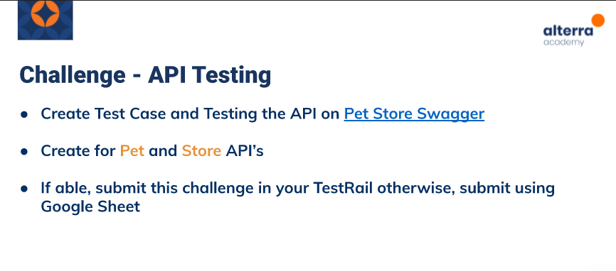

# (15) REST API Testing

## Resume 

Dalam Materi ini, mempelajari :
1. Testing API 
2. API Testing Proses
3. Advantages and Challenges

### Testing API
API Testing adalah testing yang dilakukan pada layer dimana API yang didesain untuk berkomunikasi pada aplikasi dipastikan fungsional test nya melalui rangkaian test.
Tujuannya adalah meluaskan cakupan dan test sedini mungkin dimana UI masih belum sepenuhnya siap untuk di test.

Macam-macam API Testing :
1. Functionality (Validasi fitur)
2. Load Test (menguji kekuatan sistem)
3. Security (keamanan sistem)

API Testing Tools :
1. Postman
2. APACHE JMeter
3. frisby.js
4. REST-assured

### API Testing Proses

API Testing Proses :
1. Review Spesifikasi

Bertujuan untuk review dari spesifikasi API dari use case dokumen.

2. Pengembangan Spesifikasi

Memastikan dokumeni testing dan ekspetasi hasilnya pada tiap test case. 

3. Pengembangan dalam Framework

Memilih tools dalam API Testing.

4. Pengembangan Test Case

Membuat Test Case dan Test Scenario

5. Eksekusi dan Report 

Mengeksekusi Test Case dan Membuat Laporan.

### Advantages and Challenges

Keuntungan dalam API Testing:
1. Efisiensi Waktu
2. Bahasa yang independen
3. Mengurangi biaya testing
4. Mengurangi Resiko

Tantangan dalam API Testing :
1. Kombinasi dan pemilihan parameter
2. Tidak ada GUI
3. Harus mengetahui parameter
4. Perlu testing error handling pada tiap API

## TASK

Soal : 

Jawab: [Docs_Jawab](https://docs.google.com/spreadsheets/d/1BBpRs-ZHdRNDBRO2CLdQt1pM0iU0PC2GzGMlAr6CERE/edit?usp=sharing);
