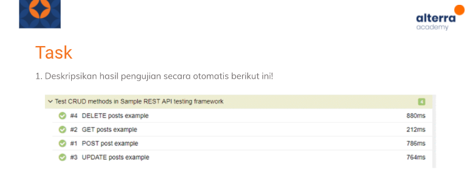
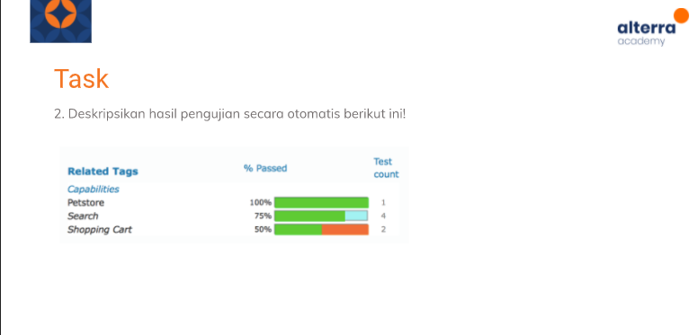

# (16) From Manual to Automation Testing

## Resume 

Dalam Materi ini, mempelajari :
1. Manual Testing 
2. Automation Testing
3. Automate Testing Process

### Manual Testing 
Test Case yang dieksekusi dengan tester manusia dansoftware dimana objektifnya adalah eksplorasi dan observasi menggunakan manusia.Keunggulan manual testing adalah pada sisi eksplorasi,kecepatan, dan ketepatan.

Keuntungan :
1. Visual feedback cepat dan akurat
2. Biaya tidak mahal
3. Pada test yang sederhana ,manual testing tidak menghabiskan waktu

Kerugian : 
1. Gampang terjadi kesalahan
2. Tidak bisa melakukan reuse

### Automation Testing
Pengujian Test Case menggunakan automation tools. dimana objektifnya pada efisiensi dan menyeluruh. Selain itu juga fleksibel,cepat,dan terhindar dari error.

Automasi digunakan pada :
1. Test Case yang perlu Berulang
2. Test case yang sulit dilakukan manual
3. Mempercepat waktu test

Automasi tidak digunakan pada :
1. Test Case yang baru dibuat dan belum pernah dieksekusi manual
2. Test Case yang memerlukan perubahan secara sering.

### Automate Testing Process
1. Test Tool Selection
Memilih tool terbaik sesuai dengan prinsip usability,simplicity,cost sebaik mungkin

2. Define Scope of Automation
Mendefinisikan secara jelas area pada test case yang akan dijadikan automated

3. Planning,Design and Development
Membuat,merencanakan, dan mengembangkan script untuk automatisasi test.

4. Test Execution
Eksekusi Script automasi yang telah dibuat

5. Maintenance
Pada setiap cycle pengembangan, script automation perlu untuk dilakukan penambahan, review, serta perawatan untuk menjaga kualitas script.

## TASK

Soal : 

Soal 2 :

Jawab: [Docs_Jawab](https://docs.google.com/document/d/1toG4O8GHQkRzXtTH-XAXUDuj7eLEhsBqrcVqLTx4Ih0/edit?usp=sharing);
