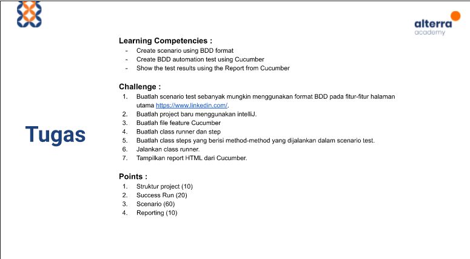

# (17) Behavior Driven Development

## Resume 

Dalam Materi ini, mempelajari :
1. Behaviour Driven Development 
2. Cucumber
3. BDD with Cucumber

### Behaviour Driven Development 
BDD merupakan pola pengembangan dimana pada setiap cyclenya melibatkan seluruh stakeholder, bukan hanya pengembang dan penguji. Jadi kemungkinan terjadinya kesalahpahaman akan mengecil ketika mengembangkan suatu fitur.

BDD Format :
1. User Story
2. * As a (role)
    * I want (Goals)

    * So that (Reason of goals)
3. Skenario
4. Gherkin :  
    * Given
    * When
    * Then

### Cucumber
Cucumber adalah tools yang mendukung BDD, cucumber akan membaca semacam ketentuan yang dapat dieksekusi dimana ditulis menggunakan teks biasa dan ketentuan tersebut memvalidasi sistem melakukan apa yang dituliskan dalam ketentuan tersebut.

### BDD with Cucumber
Beikut merupakan pola pengembangan BBD dengan Cucumber:
1. Menulis User Story

Pola Penulisan menggunakan Gherkin

2. Map Steps to Java

Mengkonfigurasikan langkah-langkah script dan validasinya ke dalam java

3. Configure Stories

Mengkombinasikan Story dengan Langkah-langkah Script

4. Run Stories

Melakukan Eksekusi dari story yang telah dibuat.

5. Reporting

Melakukan report hasil dari eksekusi.

## TASK

Soal : 

  

Jawab: [Docs_Jawab](https://docs.google.com/document/d/1ckgTqGHdFwQVEcce-G_tVGcRM9hQTrO31x3j5kVBwLs/edit?usp=sharing);