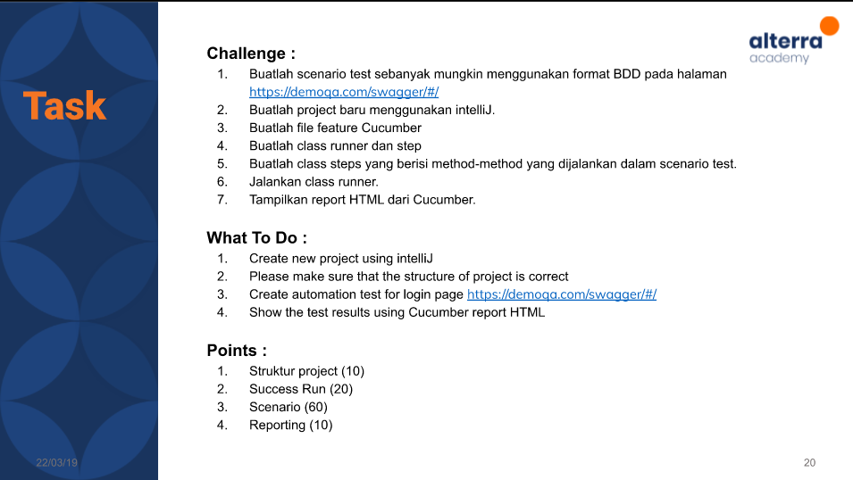

# (18) RESTful API Testing with Rest Assured

## Resume 

Dalam Materi ini, mempelajari :
1. API Concept and Fundamental 
2. Practical Test Pyramid
3. Rest Assured

### API Concept and Fundamental 
REST merupakan singkatan dari Representational State Transfer. Standar arsitektur komunikasi yang digunakan dalam layanan berbasis web. Dengan HTTP Method sebagai protokolnya. API adalah penghubung dan REST adalah aturan yang membatasinya. Konsep dari API adalah menjadi penengah antara client dan server dimana ia menerima request dari client untuk disampaikan ke server dan menyampaikan response dari server ke client.

Fundamental API Integration: 

Mobile App >> API Server >> Ext Process >> API Testing

Test Process:
1. Record,Define API Information
2. Parsing, Filter or Recording API Data and then extract
3. Reconstruction API calls, and sent them from a simulate client
4. Test Validation

### Practical Test Pyramid 
1. UI (Memvalidasi melalui UI bahwa aplikasi menampilkan hasil sesuai ekspetasi)
2. Integration (Validasi yang melibatkan interaksi dua modul atau subsystem sebagai suatu kombinasi melalui API )
3. Component (Pengujian yang dilakukan pada setiap komponen individu melalui API )
4. Unit (Pengujian melalui modul terkecil dalam aplikasi biasanya melaluli method methodnya)

### Rest Assured
Rest Assured merupakan library pada JAVA yang banyak digunakan untuk pengujian otomasi REST API.

Fitur pada rest assured :
1. Support untuk menggunakan HTTP Method
2. Support untuk BDDD/Gherkin
3. Menggunakan Hamcrest mathces untuk pengecekan (equalTo)
4. Menggunakan Gpath untuk seleksi elemen dari response JSON.

## TASK

Soal : 

  

Jawab: [Docs_Jawab](https://docs.google.com/document/d/1zdsrXebohrOJWLPiQrMbeTziKEwg2EwWPxOXxBSnd4Y/edit?usp=sharing);