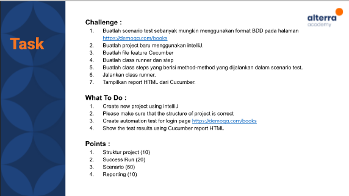

# (19) Web Programming

## Resume 

Dalam Materi ini, mempelajari :
1. Serenity BDD 
2. Langkah-langkah menggunakan Serenity BDD
3. Menulis test dalam serenity

### Serenity BDD 
Serenity adalah open source BDD Framework yang membantu QA dalam menulis Test acceptance automasi secara baik dan mudah dirawat.

Arsitektur dalam serenity terdiri dari: 
1. Requirements
2. Tests
3. Steps
4. Pages
5. Reports

### Langkah-langkah menggunakan Serenity BDD
1. Define Requirements

    Langkah pertama dalam menggunakan serenity adalah menulis requirement atau disebut user-stories dengan kriteria yang disetujui untuk membantu klarifikasi requirement tersebut.

2. Automated acceptance criteria

    Mendeskripsikan acceptance criteria ke dalam high-level business sehingga dapat dipahami stakeholder yang lain. Dengan bantuan cucumber sehingga dapat dijalankan oleh serenity.

3. Implement The Test 

    Selanjutnya kriteria diimplementasikan menjadi baris kode sehingga dapat dijalankan pada aplikasi.

4. Report on Test Result

    Selanjutnya serenity akan membuat detail report hasil testing yang berisikan naratif test, screenshoot step dan hasil test termasuk waktu eksekusi kode dan pesan error jika terdapat test yang gagal.

### Menulis test dalam serenity

menulis test dalam serenity :
1. Create file stories (membuat test scenario)
2. create file test clase (automasi stori)
3. create file test steps (membuat step skenario)
4. create file page object (interaksi dengan browser)

Tools atau perintah untuk mempermudah menggunakan serenity:
1. Serenity Properties
    
    Terdapat beberapa properti serenity untuk mempermudah menggunakannya seperti webdriver untuk mengatur browser yang akan digunakan.

2. Parameter Injection

    Text dalam stori dapat dijadikan variabel dimana kita dapat menggunakan simbol bracket{} pada test class untuk memanggilnya.

3. Meta Filterring

    Untuk mengatur skenario juga terdapat tag-tag yang khusus untuk perintah spesifik dalam menjalankan stori.

4. Parameterised Scenario

    Fitur untuk membuat skenario dengan sisi value yang dimasukkan berbeda namun pada skenario yang sama.    

## TASK

Soal : 

 

Jawab: [Docs_Jawab](https://docs.google.com/document/d/1BEKmnRtNzvNU_8OBOYqGBcGOj8Kb0JRepPDakyLX2Uc/edit?usp=sharing);
