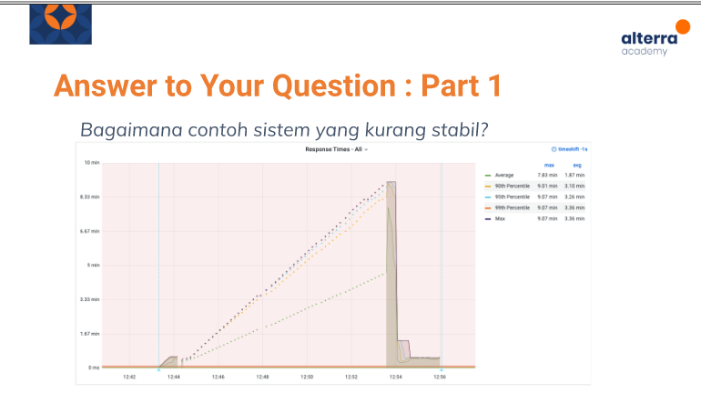

# (21) Fundamental Performance Test

## Resume 

Dalam Materi ini, mempelajari :
1. Apa itu Performance Test 
2. Pertanyaan Seputar Performance Test
3. Tipe-tipe dalam performance Testing

### Apa itu Performance Test
Performance Test merupakan teknik non functional testing untuk menentukan parameter sistem dalam hal responsif dan stabilitas dibawah berbagai beban(load) kerja.

Performance Testing mengukur stabilitas ,ketahanan, dan penggunaan suatu daya dalam sistem.

### Pertanyaan Seputar Performance Test
1. Apa yang diukur dari performance test?

      * performa suatu aplikasi sampai batas tertentu
      * Bukan Functional Test
      * Bisa Dalam berbagi macam bentuk tergantung enviroment dengan target mengukur reliabolity,stability,avaibility sistem

2. Mengapa Performance Test jarang dilakukan?

      * Performance Testing umumnya cukup  mahal untuk dijalankan. namun tetap berguna untuk mengukur kemampuan sistem mngakomodasi traffic. Hal ini disebabkan perlunya persiapan mengatur enviroment yang terpisah dari production.

3. Apa yang perlu diperhatikan dari Performance Testing ?

      * throughput
      * response data

### Tipe-tipe dalam performance Testing
Tipe-tipe dalam performance Testing :

1. Smoke Testing

    Dilakukan untuj verify script yang sudah dibuat,apakah suatu sistem dapat menghandle minimal load tanpa sutau masalah.

2. Load Testing

    Pengujian yang paling sederhana uang dilakukan untuk memahami perilaku sistem dalam keadaan beban tertentu. Hasil dari load test digunakan untuk mengukur kepentingan bisnis saat transaksi yang kritis, akankah sistem mampu bertahan si situasi tersebut. Sederhananya Load Testing melihat kelakukan sistem saat traffic normal dan traffic puncak.

3. Stress Testing

    Metode ini dilakukan untuk mengamati kemampuan dan kestabilan sistem pada saat kondisi ekstrem. Dilakukan secara bertahap load normal,puncak,dan melebihinya. Kemudian turun untuk melihat proses recovery.

4. Spike Testing

    Pengujian seperti stress testing, namun pada spike testing traffic akan dibuat menjadi puncak dalam waktu singkat dan melihat respon sistem yang diuji.

5. Soak Testing

    Test untuk mengetahui ketahanan ketika dalam tekanan di bawah puncak dalam jangka panjang. Dapat juga unutk mengetahui adanya bug pada race condition, memory leaks,db connection,dsb.

## TASK

### Soal 1 : 

 

<b>Jawaban :</b> Volume Test adalah salah satu non-functional test yang menguji ketahanan suatu sistem ketika diberi database yang banyak

### Soal 2

 

<b>Jawaban :</b> Pada pengujian diatas suatu sistem bisa dikatakan tidak stabil karena pada saat pengujian pada sistem dengan load 90th percentile, 95th percentile dan max memiliki waktu pada max dan avg dengan nilai yang sama yaitu max 9.07 min dan avg 3.36 min. Seharusnya dapat bertahap dan tidak sama persis.

