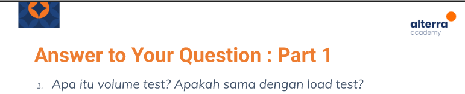
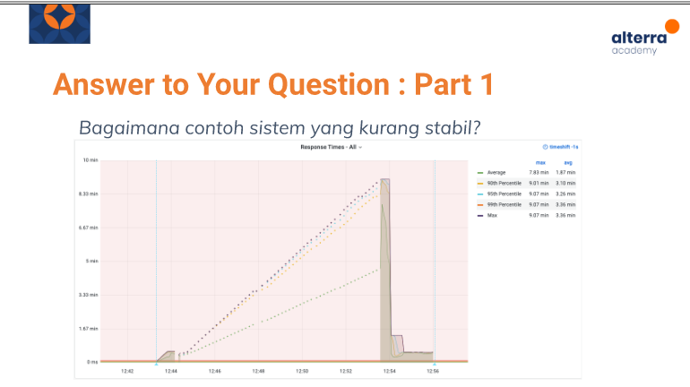

# (22) Fundamental Performance Test

## Resume 

Dalam Materi ini, mempelajari :
1. JMeter 
2. Components of JMeter Script
3. How To record with JMeter

### JMeter 
Apache JMeter adalah perangkat lunak open-source aplikasi dekstop java yang dirancang untuk memuat uji perilaku fungsional dan mengukur kinerja situs web. JMeter banyak digunakan karena Open-Source dan mudah digunakan dengan GUI/non-GUI.

### Components of JMeter Script
1. Test Plan
2. Thread Group
3. Samplers
4. Config Elements
5. Listeners
6. Timers
7. Assertions
8. Pre-post processors

### How To record with JMeter
Langkah Penggunaan JMeter:
1. Select Template
2. Enable HTTP(S) Test Script Recorder
3. Start HTTP(S) Test Script Recorder
4. Set up Proxy on your Firefox Browser
5. Start Recording
6. Stop recording
7. Run the script


Pada Summary Report
``` 
Success rate = (jumlah_response_2xx/jumlah_thread)*100%
```
## TASK

### Soal 1 : 


<br>

<b>Jawaban :</b> Volume Test adalah salah satu non-functional test yang menguji ketahanan suatu sistem ketika diberi database yang banyak

### Soal 2


<br>

<b>Jawaban :</b> Pada pengujian diatas suatu sistem bisa dikatakan tidak stabil karena pada saat pengujian pada sistem dengan load 90th percentile, 95th percentile dan max memiliki waktu pada max dan avg dengan nilai yang sama yaitu max 9.07 min dan avg 3.36 min. Seharusnya dapat bertahap dan tidak sama persis.


