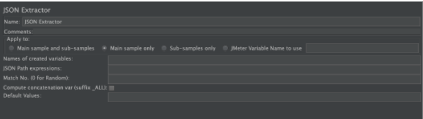
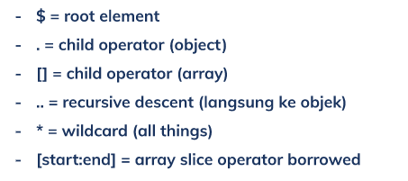
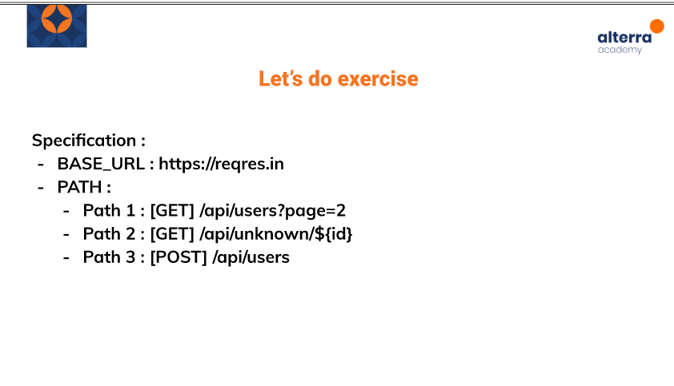

# (23) Post Processor

## Resume 

Dalam Materi ini, mempelajari :
1. Post Processor
2. JSON Extractor
3. JSON Path

### Post Processor
Elemen dalam Test Plan yang berfungsi untuk melakukan beberapa aksi setelah sampler request berhasil di proses. Post Processor biasanya digunakan untuk melakukan ekstraksi data dari respon sampler request. Ekstraksi nilai variabel dar HTTP request dan melakukan pass value ke request sub.

### JSON Extractor
JSON extractor dilakukan dengan menambahkan pada bagian HTTP Request.

Pengisian Value yaitu mengisi variabel spesifik yang ingin dilihat, kemudian memasukkan path setelah itu mengisi value yang ingin data nya dilihat.

### JSON Path
JSON Path adalah alamat spesifik letak data dalam JSON ketika kita ingin melihat suatu nilai ketika melakukan ekstraksi dari JSON response.

Beberapa Ekspresi yang digunakan yaitu:

## Task

### Soal :

### Jawab:

1. [Program JMeter](./praktikum/)

2. [Laporan Praktikum](https://docs.google.com/document/d/1nxSXWIen7OvPnHsfKdNHRDoGVnAAoNnY_zZhyWE-aJY/edit?usp=sharing)

