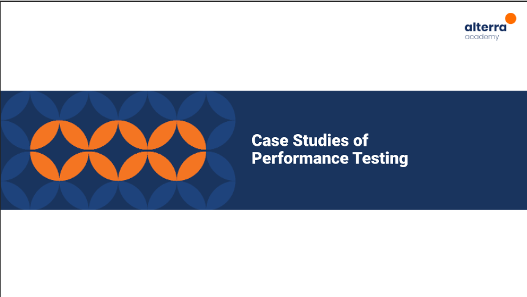
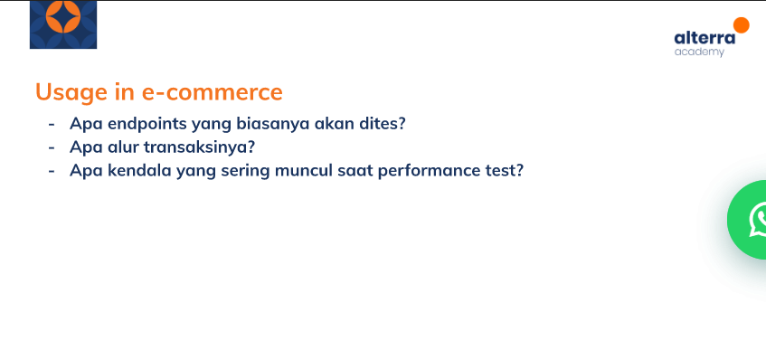
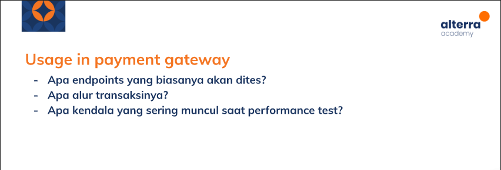

# (24) Understanding Jmeter Result

## Resume 

Dalam Materi ini, mempelajari :
1. Summary Report dan Agregate Report
2. Throughput
3. Overview of a Performance Test Report

### Summary Report dan Agregate Report
Summary Report dan Agregate Report adalah listener yang akan menampilkan hasil eksekusi dari test yang dijalankan. Perbedaan keduanya adalah pada summary terdapat Standar deviasi dan pada agregate terdapat median,90,95,99 percentile.

### Throughput
Throughput adalah jumlah request yang mampu dijalankan dalam satu periode waktu. 

Terdapat 4 case jika kita sedang menganalisa suatu hasil pengujian Jmeter:
1. Response Time `low` dan Throughput `low`

Case ini namun sulit terjadi.

2. Response Time `low` dan Throughput `high`

Jika hasil seperti ini maka Server masih berjalan dengan baik.

3. Response Time `high` dan Throughput `low`

Jika seperti ini maka server masih tidak berkapabilitas cukup.

4. Response Time `high` dan Throughput `high`

Jika seperti ini maka bisa jadi sudah terjadi kesalahan/kegagalan dalam aplikasi karena request membutuhkan banyak waktu.

### Overview of a Performance Test Report
1. Pembahasan Data yang Sudah Dimiliki

Berisi Summary tentang sistem, Kondisi awal sistem,Target yang ingin dicapai

2. Data Performance Test yang Didapatkan

Memasukkan Data dari metrics yang didapat

3. Interpretasi Data Performance Test

Berisi Interpretasi hasil metrics

4. Saran

## Task

### Soal :

 
 

 
 

### Jawab:

Usage in Ecommerce:

1.  Contoh Endpoint pada sistem pembelian barang

2. Pada sistem pembelian alur setelah login yaitu konsumen memilih barang dan melakukan checkout. Pada alur ini dilakukan testing dengan melakukan test dimana akan dibuat seolah user melakukan akses pembelian barang pada waktu yang sama. Dimana sistem yang terbebani jika alur transaksi berjalan lancar maka akan diberikan response berhasil dan bisa melanjutkan transaksi sukses melakukan pembelian.

3. Kendala performance test adalah menentukan kapan suatu website akan mengalami lonjakan traffic yang tidak disebabkan selain event yang biasa terjadi. Serta mencari penyebab suatu hasil jika tidak sesuai harapan.

Usage in Payment:

1.  Contoh Endpoint pada sistem melakukan pembayaran digital

2. Pada sistem pembayaran ketika konsumen melakukan pembayaran barang. Pada alur ini dilakukan testing dengan melakukan test dimana akan dibuat seolah user melakukan akses pembayaran barang pada waktu yang sama. Dimana sistem yang terbebani jika alur transaksi berjalan lancar maka akan diberikan response berhasil dan transaksi pembayaran berhasil dilakukan.

3. Kendala performance test adalah menentukan kapan suatu website akan mengalami lonjakan traffic yang tidak disebabkan selain event yang biasa terjadi. Serta mencari penyebab suatu hasil jika tidak sesuai harapan.

