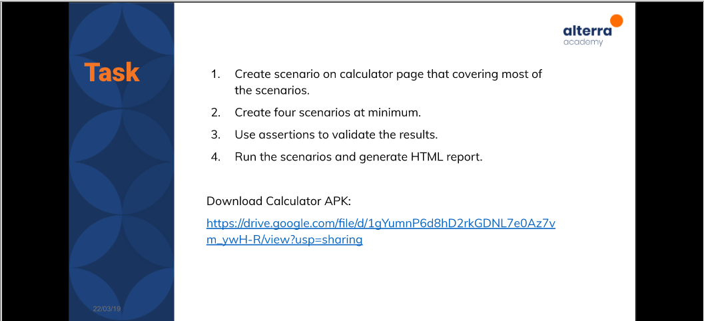

# (25) Mobile Testing

## Resume 

Dalam Materi ini, mempelajari :
1. Pengenalan Appium
2. Penggunaan Appium
3. Contoh Appium Action

### Pengenalan Appium
Appium adalah Kerangka Kerja untuk otomatisasi pengujian pada perangkat lunak aplikasi mobile. Appium bekerja dengan banyak bahasa pemrograman seperti java,python, dan javascript. Appium terdiri dari Appium Server dan Appium Client. Penginstalan membutuhkan Java JDK 8/11, Emulator android,Appium Dekstop,Nide JS, dan appium doctor untuk pembantu.

### Contoh Appium Action
1. Menginstal maven dependencies
2. Membuat cucumber feature
3. Membuat step step yang akan digunakan
4. Inisiasi Appium
5. menambahkan deskripsi pengujian yang dilakukan dengan appium
6. Menggunakan hooks
7. Membuat Page Object Design Pattern
8. Jalankan pengujian

### Menggunakan Appium Dekstop dan Inspektor
1. Working With Wait

  Fitur Appium dimana kita bisa mengatur untuk suatu element berada pada kondisi tertentu.

2. BasePageObject Class

  Fitur class untuk mengcover semua appium function sehingga kode yang ditulis bisa lebih sedikit.

3. Complec Actions

  Kita dapat melakukan action seperti touch,swipe,hold,tap multiple times.

4. Taking Screenshoot

  Melakukan screenshoot.

5. Configuration File

  Kita dapat melakukan konfigurasi diluar kode implementasi pada properti file sehingga ketika kita melakukan perubahan kode, hanya perlu melakukan update pada file konfigurasi.

## TASK

Soal : 

  

Jawab: [Docs_Jawab](https://docs.google.com/document/d/1qHcILB-zQq6ej3DfkxPOviqdb2TrN9JJEjv1mDS-idg/edit?usp=sharing);