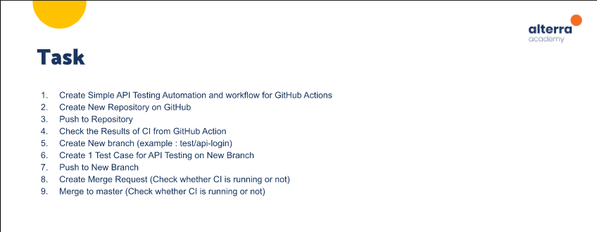

# (25) Testing in CI/CD Pipeline

## Resume 

Dalam Materi ini, mempelajari :
1. Pengenalan CI/CD
2. Proses dalam CI/CD
3. Keuntungan dan Biaya dalam CI/CD

### Pengenalan CI/CD
1. Continous Integration (CI) adalah proses proses integrasi kode kedalam repositori dan melakukan build/testing setiap ada perubahan secara otomatis secepat mungkin.

2. Continous Delivery adalah proses membuat suatu software dapat melakukan rilis perubahan pada production setiap saat. Perubahan secara otomatis akan di push ke staging system. Continous Deployment melakukan perubahan sampai tahap push perubahan ke production system secara otomatis.

### Proses dalam CI/CD
Continous Integration mencakup Build dan Test.

Continous Delivery mencakup Acceptance Test, Deploy to Staging dan Deploy to production secara manual.

Continous Deployment mencakup Acceptance Test, Deploy to Staging dan Deploy to production secara otomatis.

Secara keseluruhan proses CI/CD dalah serangkaian Commit-Build-Test-Deploy.

Karakteristik proses yang baik dalam CI :
1. Decoupled Stages
2. Repeatable
3. Fail Fast

Karakteristik proses yang baik dalam CD :
1. Design with system in mind
2. Pipelines
3. Globally Unique versions

### Keuntungan dalam CI/CD
Keuntungan CI:
1. Detecting Bug in Early Stage
2. Reduces Bug Count
3. Development Process More Transparent
4. Efficient

Keuntungan CD:
1. Reduce the Risk
2. Painless Deployment
3. Reduces Costs
4. Automated and Transparent Process
5. Releases More Frequently

Cost in CI:
1. Write Automation Test
2. Server For Automated Test
3. Merge The Code as Often as Possible

Cost in CD:
1. Strong Foundation in CI
2. Need Highest Quality of Test
3. Documentation Needs to Be Updated Frequently

CI/CD tools:
1. Jenkins
2. Bamboo
3. circleCI
4. Travis CI
5. Github Actions
6. Azure DevOps

## TASK

Soal : 

  

Jawab: [Docs_Jawab](https://docs.google.com/document/d/1CKw4nhFoG58rI9y98MhOOawSxghdfUw6uwSL5uQbQdY/edit?usp=sharing);