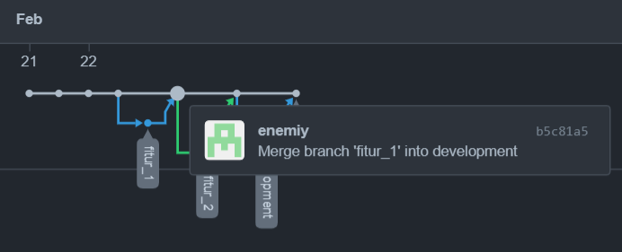
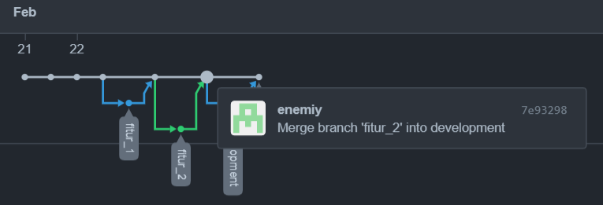
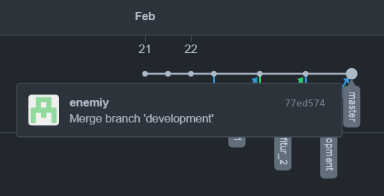

# (2) Versioning Control with Git

## Resume 

Dalam Materi ini, mempelajari :
1. Version Control System
2. Git dan Github
3. Berkolaborasi dengan Git

### Version Control System
Dalam menyelesaikan suatu projek bersama kita dapat menggunakan Version Control System 
untuk versioning program agar memudahkan dalam berkolaborasi sesama anggota team. 
VCS memungkinkan untuk mengontrol versi dari kode suatu program yang sedang berjalan.
Perkembangannya dimulai dari `single user` dimana kode hanya ada pada local komputer menjadi `centralized` yang harus memerlukan koneksi internet untuk menjaga kode tetap sama antar komputer dan pada akhirnya mencapai tahap `distributed` dimana penggunaanya menyelesaikan permasalahan pada kedua metode yang sebelumnya.

### Git dan Github
Git merupakan contoh VCS yang populer digunakan untuk berkolaborasi dalam projek software development. 
Dengan git kita dapat melacak perubahan yang ada pada kode program.
Github merupakan layanan hosting server git yang populer digunakan sehingga ketika berkolaborasi kita dapat mengunggah kode ke server github.
Dalam penggunaan git terdapat fase utama dengan printah-peintah tertentu seperti :
 - git `init`,`clone`, `config` sebagai inisiasi awal suatu repository
 - git `status`,`add`,`commit`,`diff`,`stash`,`ignore` sebagi perintah ketika ingin melakukan perubahan
 - git `log`, `checkout` ,`reset` sebagai melihat tracking commit repositori
 - git `fetch`,`pull`,`push` sebagai perintah untuk sinkronisasi
 
### Berkolaborasi dalam Git
Dalam berkolaborasi dengan git kita dapat menggunakan fitur branching pada git dalam development dan kode yang dibuat masing-masing dapat disatukan dengan git merge sehingga dalam berkolaborasi bisa menyingkat efisiensi waktu.

## TASK
### Membuat Project Branching Bebas
Pada Task ini membuat commit projek apapun dimana berisi penggabungan dari branch fitur_1 dan fitur_2 ke branch development kemudian di merge ke branch utama/master

Berikut SS hasil dari pratikum pada network->insight:

1. merge branch fitur_1 ke development

2. merge branch fitur_2 ke development

3. merge branch development ke master

