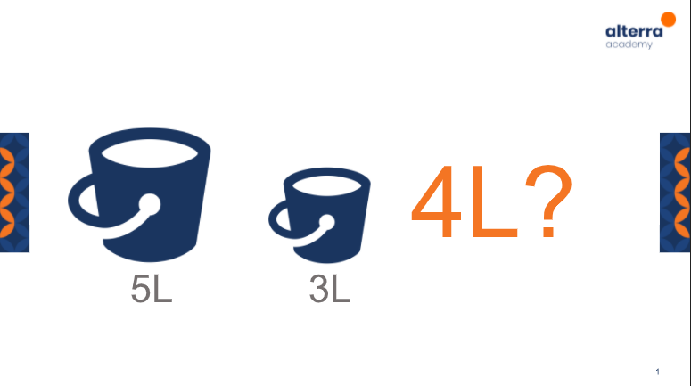

# (3) Software Testing as Career Path

## Resume 

Dalam Materi ini, mempelajari :
1. Software Testing
2. Technical dan Non-Technical Skills
3. How To become Software Tester

### Software Testing
Proses verifikasi dan validasi pada suatu program untuk melihat apakah program telah sesuai dengan kebutuhan dan menghasilkan sesuai ekspetasi yang telah rencanakan. Software tester melakukan Pemahaman terhadap dokumen kebutuhan, Membuat uji kasus, Mengeksekusi uji kasus, Melaporkan dan menguji ulang, dan rapat dalam review meeting.

### Technical dan Non-Technical Skills
Dalam menjadi Softaware Tester terdapat beberapa hal yang harus dikuasai:
1. Technical Skills :
  * Basic Knowledge Unix/Linux
  * Menguasai Test Management Tool
  * Menguasai Tracking Management Tool
  * Menguasai Automation Test Tool

2. Non-Technical Skills :
  * Memiliki Analytical Skill (Memecah permasalahan kompleks menjadi bagian bagian kecil agar mudah dipahami )
  * Memiliki Communication Skill (Mampu berkomunikasi dan mengkomunikasikan Test Prosedur/ Hasil Test dengan cara yang mudah untuk dipahami orang lain)
  * Memiliki Time Management & Organization  Skill yang baik ( Dapat memanajemen waktu dengan efisien serta produktif. Selain itu mampu berorganisasi dengan baik)
  * Memiliki Great Attitude ( Mampu menjadi orang yang memiliki mindset 'test to break', berorientasi detail, serta kemauan belajar yang tinggi, dan mampu berkembang untuk menjadi lebih baik) 
  * Passion ( Memiliki rasa ketertarikan tinggi ketika melakukan Software Testing)
 
### How to Become Software Tester
Mencoba melakukan magang ketika menguasai salah satu dari software testing, Test Case Management Tool, Automation Test serta kemudian lanjut Melamar Pekerjaan. Terdapat beberapa jenjang karir dalam Software Tester dimulai dari Junior QA (FG), QA(1-2 tahun), Senior QA (>3 tahun), QA Lead(5-6), QA Manager (8-11 tahun). 

## TASK
Bagaimana cara mendapatkan Air 4L dari Ember yang tersedia berukuran 3L dan 5L?

Jawaban :
  1. Mengisi Air dalam Ember 5L (Ember 5L berisi penuh, Ember 3L berisi kosong)
  2. Memindahkan Air dari Ember 5L ke Ember 3L (ember 5L berisi 2L, Ember 3L berisi penuh)
  3. Membuang air pada Ember 3L. Kemudian memindahkan kembali Air 2L di Ember 5L ke Ember 3L (Ember 5L berisi kosong, Ember 3L berisi 2L)
  4. Mengisi kembali Ember 5L (Ember 5L berisi penuh, Ember 3L berisi 2L )
  5. Memindahkan Air dari Ember 5L sampai Ember 3L penuh (Ember 5L berisi 4L , Ember 3L berisi penuh)
  6. Didapatkan Air Sebanyak 4L di Ember 5L

