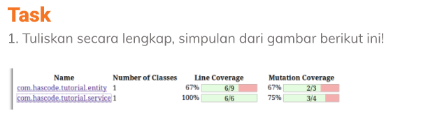
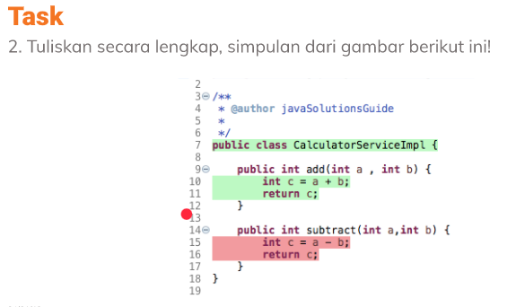

# (4) Software Testing Fundamental

## Resume 

Dalam Materi ini, mempelajari :
1. Software Testing
2. Testing Platform dan Type Testing
3. Levels of Testing

### Software Testing
Sebuah proses menganalisis item perangkat lunak untuk mendeteksi perbedaan antara kondisi yang ada dan yang dibutuhkan (bugs/defect) dan untuk mengevaluasi fitur dari item perangkat lunak. Pada bugs suatu software dapat berakibat fatal dan berbahaya. Software testing mampu menjaga suatu kualitas produk, menghemat biaya, menjaga keamanan, serta kepuasaan pengguna.

### Testing Platform dan Type Testing
Dalam melakukan testing terdapat berbagai macam platform yaitu :
  1. API
  2. Web 
  3. Mobile
  4. Desktop

Tipe-tipe testing terdiri dari :
 1. Functional Testing (manuak dan automate)
    Berfokus pada pengujian inti dari fungsionalitas suatu software.
 2. Non-Functional Testing (Performance Testing, dll)
    Berfokus pada aspek selain fungsionalitas seperti skalabilias, performa web, kestabilan, keamanan , dan lain-lain
  3. Maintenance Testing
    Berfokus pada pengujian yang dilakukan untuk menjaga integritas suatu software apabila terdapat fitur baru. Pengujian dilakukan untuk memastikan fitur baru tidak menimbulkan permasalahan pada fitur-fitur lain yang telah ada.

### Levels of Testing
Terdapat 4 macam level dalam melakukan Testing , trdiri dari :
  1. Unit Testing
      Pengujian pada modul terkecil suatu software
  2. Integration Testing 
      Pengujian pada kombinasi diantara modul-modul individu yang saling berkombinasi sebagai satu buah komponen
  3. System Testing
      Pengujian pada suatu kumpulan system yang berintegrasi membentuk software secara lengkap dan menyeluruh.
  4. Acceptance Testing
      Pengujian akhir dari software bahwa sistem yang dibangun telah sesuai dengan kebutuhan pengguna

## TASK
Menganalisa maksud dari gambar yang disediakan :

* Task 1

Jawaban : [Task_1](./Praktikum/Task_1_jawab.txt)

* Task 2

Jawaban : [Task_2](./Praktikum/Task_2_jawab.txt)