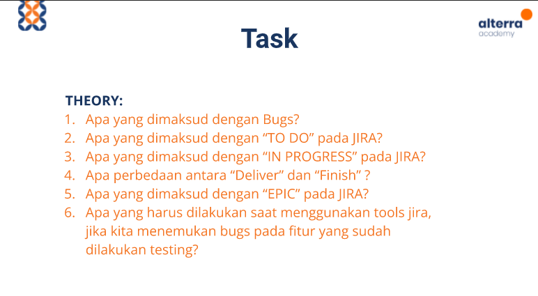

# (6)  Tracking Management Tools

## Resume 

Dalam Materi ini, mempelajari :
1. JIRA
2. Fase pada Jira
3. Issue pada JIRA

### JIRA
JIRA merupakan suatu alat bantu yang memudahkan dalam pelacakan bugs, pelacak issue, dan memanajemen sebuah proyek.

### Fase pada Jira 
Terdapat 6 Fase, terdiri dari :
1. TO Do
  Panel ini berisi story yang akan dikerjakan dan diprioritaskan sesuai dengan requirement awal yang telah disepakati
2. IN PROGRESS
  Panel yang berisi story yang sedang dikerjakan oleh para software engineer.
3. FINISH
  Panel berisi story yang telah selesai dikerjakan oleh software engineer, namun pada tahap ini belum siap untuk dilakukan pengujian/testing.
4. DELIVER
  Panel berisi story yang siap untuk dilakukan testing oleh QA.
5. NEED FIX
  Panel yang berisi hasil proses testing yang tidak sesuai kriteria lolos.
6. DONE
  Panel yang berisi fitur-fitur yang telah selesai dan sudah lolos tahap testing.

 
### Issue pada JIRA
Issue adalah fitur untuk melacak masalah yang mendasari proyek ataupun bug.

Terdapat isian utama dalam membuat issue yaitu :
1. Project (nama projek)
2. Issue Type (jenis issue yang dibuat)
3. Reporter (pembuat issue)
4. Description (deskripsi dari issue yang akan dibuat)
5. Priority (prioritas dalma mengerjakan issue)
6. Assigne (orang yang akan mengerjakan issue)
7. Sprint (waktu pengerjaan task/issue)

Terdapat 4 macam Issue :
1. Story (untuk membuat fitur baru)
2. Task (Perincian tugas-tugas yang akan dikerjakan )
3. Bug (Penemuan bug pada proses testing)
4. Epic (Pengelompokan task)

## TASK

### Theory

[Jawaban](./Praktikum/Jawaban_Task.txt)

### PRACTICE

[Docs_Task_Practice](https://docs.google.com/document/d/1gQn3R7WFctBcU2TU8rBSrioVoqbwR_LkMLDKI18RKts/edit?usp=sharing) 

