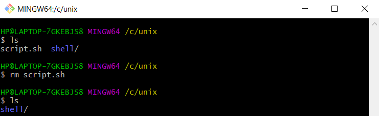

# (9) Basic Linux Command

## Resume 

Dalam Materi ini, mempelajari :
1. Alasan Penggunaan Linux
2. Basic Command pada Linux
3. Shell Scripting

### Alasan Penggunaan Linux
1. Less Resource
  Ringan digunakan pada komputer.
2. Repetitive Task Friendly
  Menyimpan script untuk melakukan task otomatis yang berulangkali
3. Powerful
  Karena hanya berupa text, antarmuka terlihat lebih stabil dibandingkan GUI

### Command pada Linux
Struktur : Command  (option) (parametere)

1. Basic command (date,cal,etc)
2. File system command (touch,cat,mv,cp,rm,mkdir,rmdir,cd,pwd)
3. Processes control command (top,clear,history,etc)
4. Utilities Programs command (ls,which,sudo,find,etc)
5. File access permission (chmod,chown,etc)
 
### Shell Scripting
Shell adalah program penghubung antara pengguna dengan kernel sistem operasi.
Shell scripting merupakan bahasa pemrograman yang dikompilasi menggunakan berdasarkan peintah pada shell.

## TASK

### 1
1. Basic command
  * cal (Menampilkan tanggal pada sistem operasi)

  

  
2. 
  * touch (membuat file baru)

   

  * cat (menampilkan isi sebuah file)

  

  * mv (memindahkan lokasi file)

  
  
  * cp (melakukan copy file)

  

  * rm (menghapus file )

  

  * mkdir (Membuat direktori baru / folder baru )

  
  
  * rmdir (Menghapus direktori/folder)

  
  
  * cd (perintah untuk berpindah direktori)
  
  
  
  * pwd (Perintah untuk menampilkan lokasi direktori kita)

  

3. Processes control command 

  * clear (Menghapus isi dari command line sehingga kembali kosong)

  

  * history(menampilkan riwayat command yang digunakan)

  

4. Utilities Programs command (ls,which,sudo,find,etc)

  * ls ( menampilkan list file yang ada pada sutau direktori)

  

  * which ( mencari suatu file )

  

  * find ( mencari semua lokasi file berdasarkan parameter yang dicari)

  

5. File access permission (chmod,chown,etc)
  * chmod ( mengubah mode dari file atau folder )

  
  
  * chown ( mengubah kepemilikan atau permission suatu file )

  

### 2