# Big Task 1 QE

## Tugas :

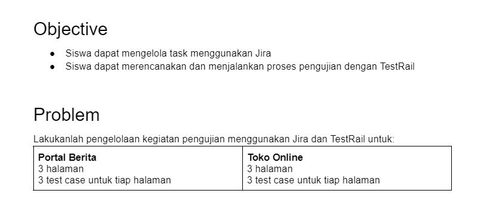

## Jawab :

### Membuka JIRA

1. Membuat Project pada jira untuk melakukan pengelolaan
Pada tahap ini membuat project baru dan 6 panel yaitu TO DO, IN PROGRESS, FINISH, DELIVER, NEED FIX, DONE
 
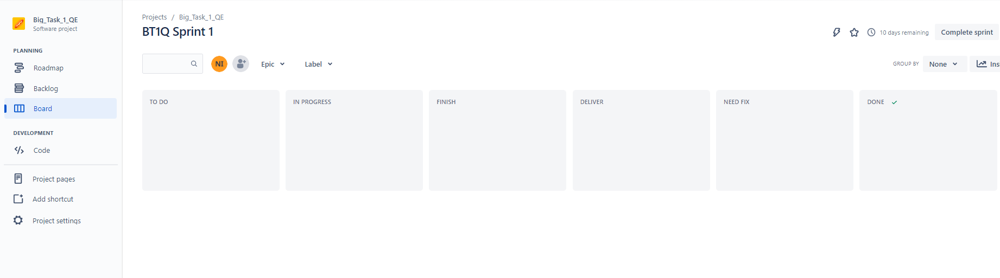

2. Membuat issue story untuk fitur yang akan di tes
Membuat issue story ke fitur yang akan di tes (diumpamakan masih dalam akan di develop programmer)

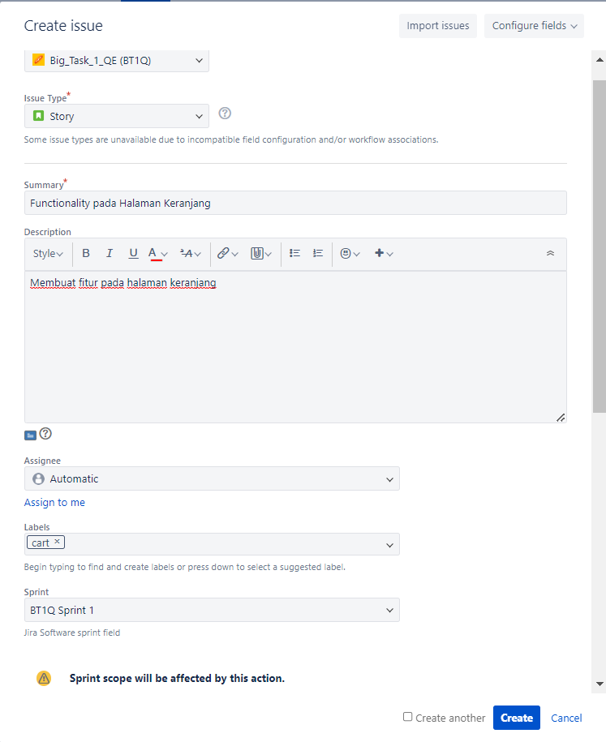

3. Story yang telah dibuat dimasukkan dalam panel TO DO
Semua story yang dibuat dimasukkan panel TO DO

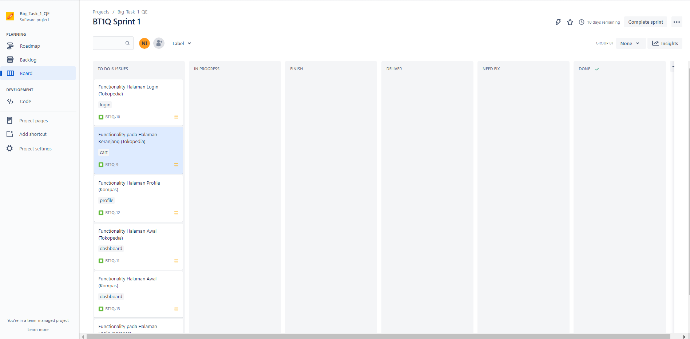

4. Story dimasukkan panel DELIVER untuk dilakukan testing
Story yang telah selesai didevelop telah siap di testing dimasukkan panel DELIVER pada board. Pada tahap ini QA melakukan pengecekan

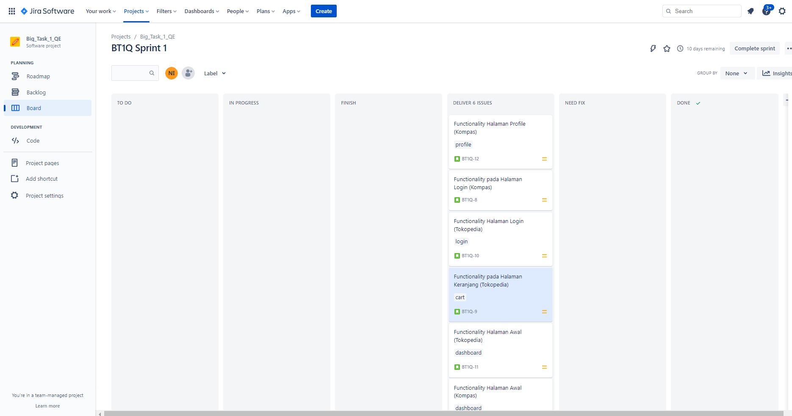

### Membuka TESTRAIL

5. QA melakukan pengelolaan testing di Test Rail dan membuat project baru
Pada saat melakukan testing QA menggunakan Testrail dan membuat project baru di testrail

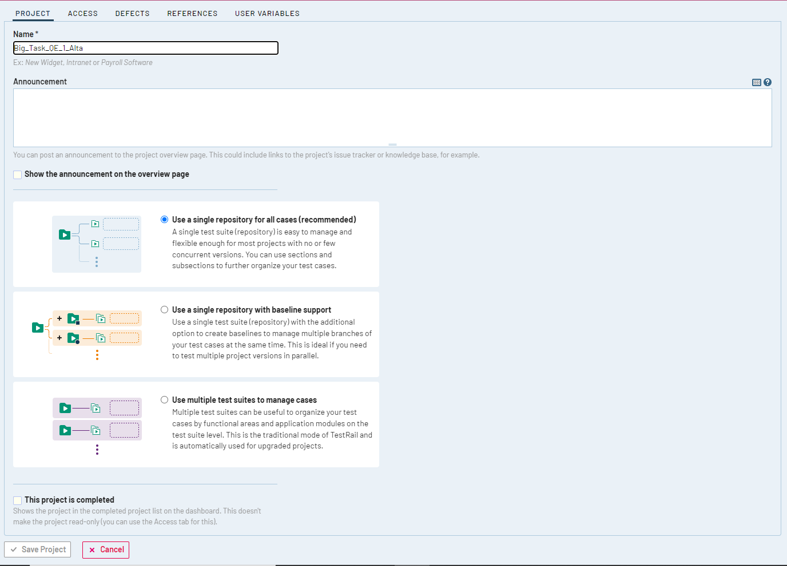

6. Membuat Milestones baru

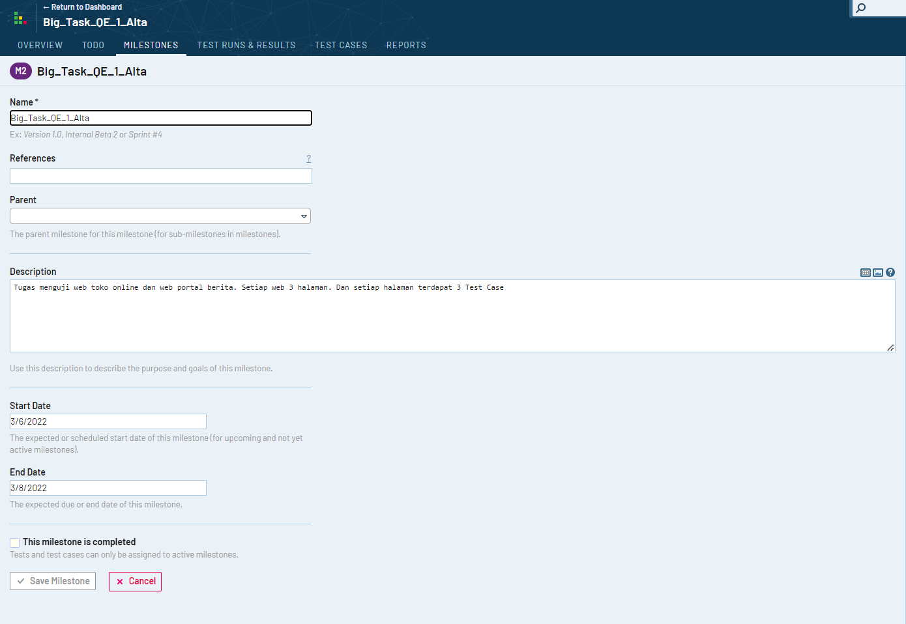

7. Membuat Test Plan

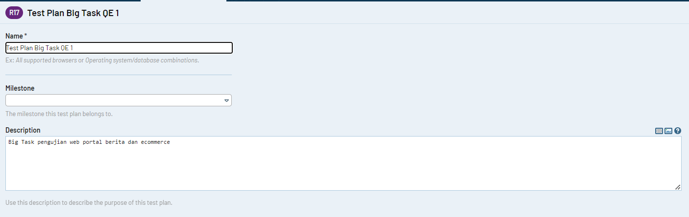

8. Membuat Test Runs 

Test Runs untuk web ecommerce (tokopedia) :

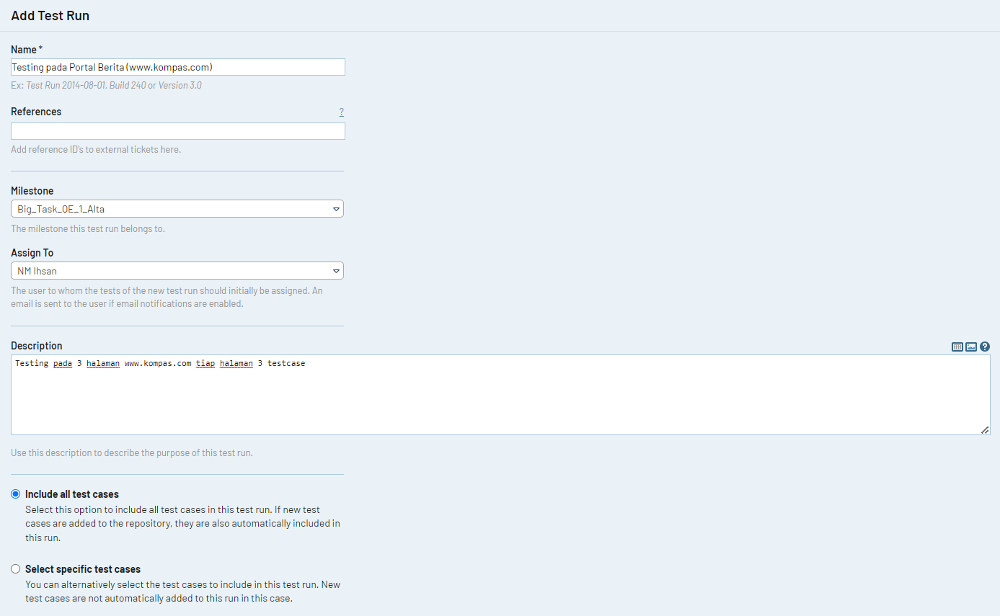

Test Runs untuk web portal berita (kompas) :

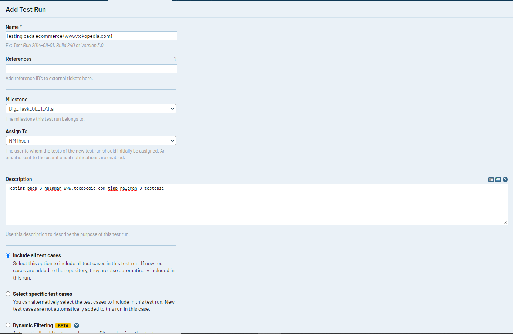

9. Membuat Test Case
Pada tahap ini membuat test case dimana terdapat 3 halaman dengan jumlah test case 3 fitur pada tiap halaman. Jadi terdapat 9 test case untuk setiap website

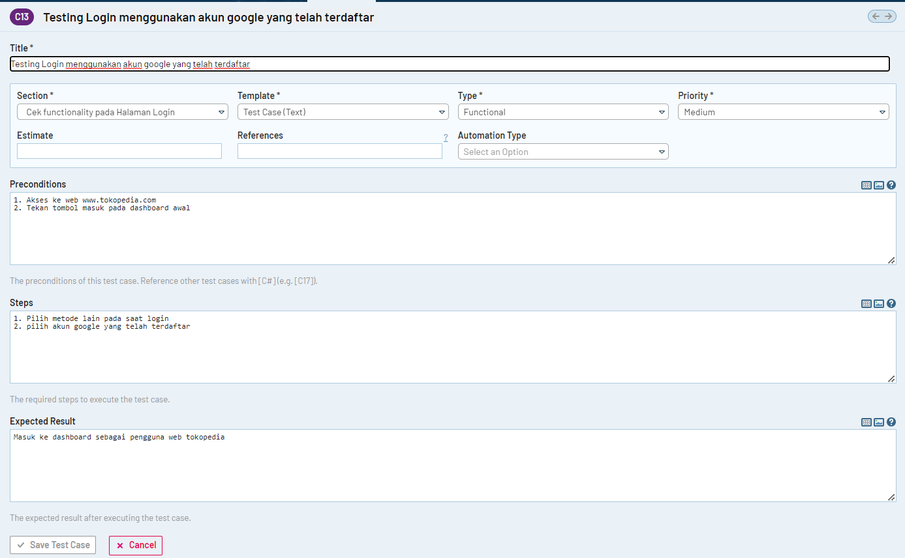

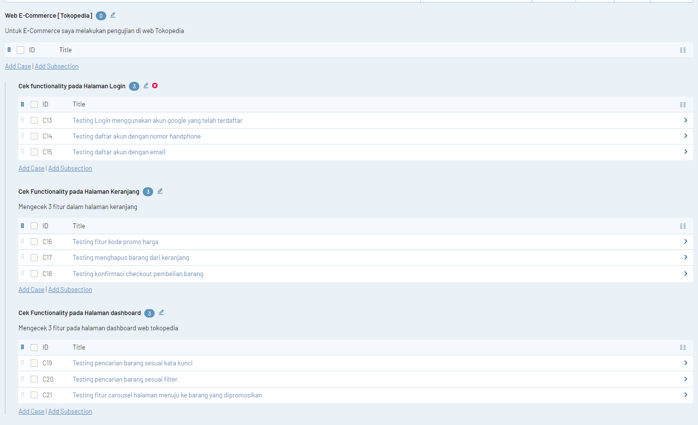

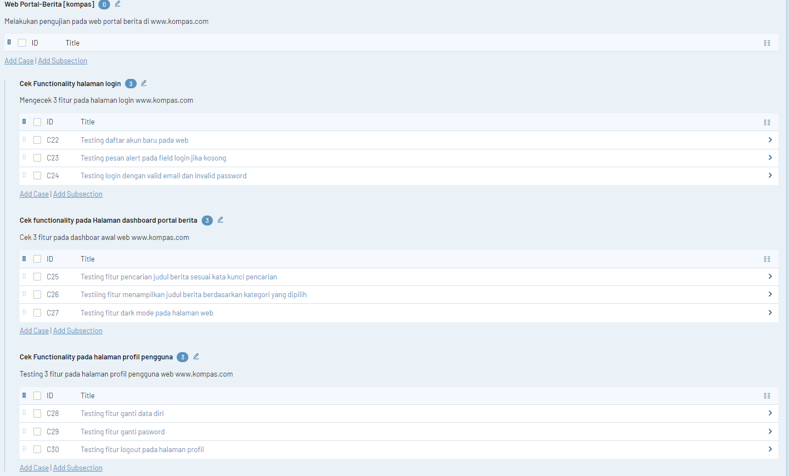

10. Eksekusi Test Case
Melakukan pengetesan sesuai test case yang telah dibuat dimana test case yang berhasil maka akan diupdate resultnya menjadi "passed" dan apabila terdapat bug maka "failed"

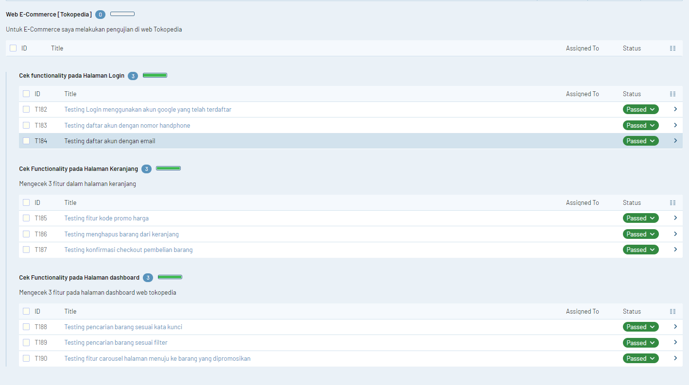

11. Melihat Report
Menampilkan report test case yang telah dieksekusi

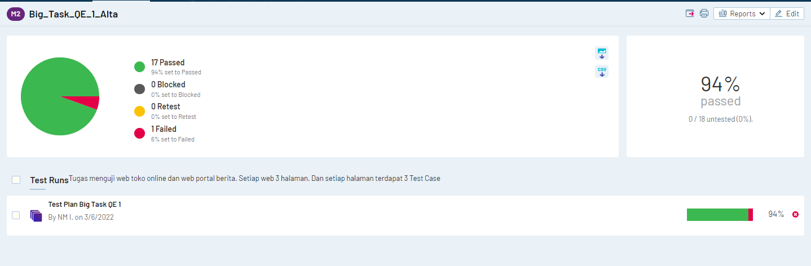

### Kembali ke JIRA 

12. Memindahkan Story ke DONE
Untuk Story yang dilakukan testing telah lolos dipindahkan dalam panel done

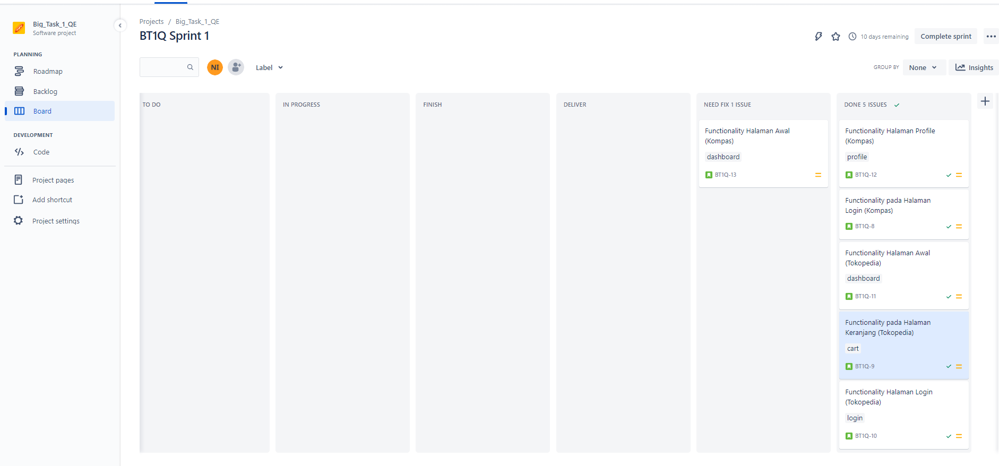

13. Membuat Issue Bugs
Karena ditemukan bugs saat test maka membuat issue bugs di JIRA dan dimasukkan dalam panel IN PROGRESS

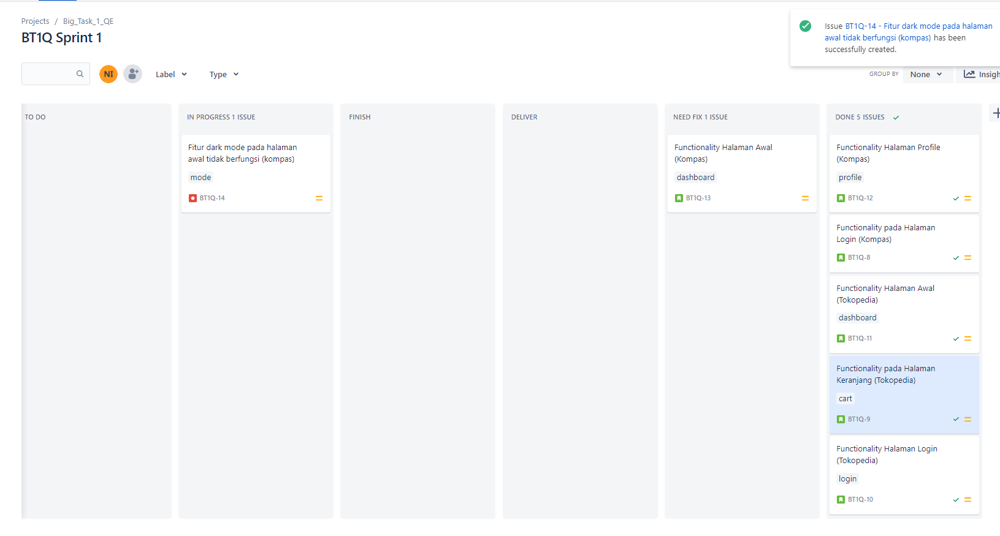

14. Menguji issue pada Panel DELIVER

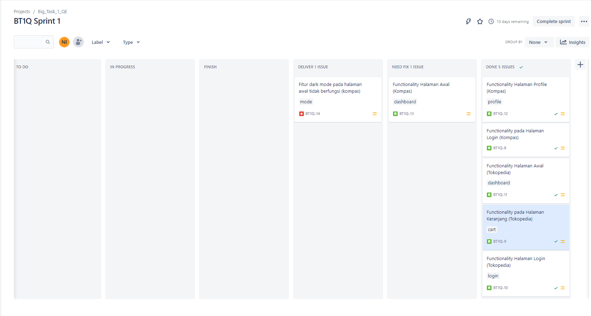

15. Memindahkan bugs beserta story-nya ke panel DONE

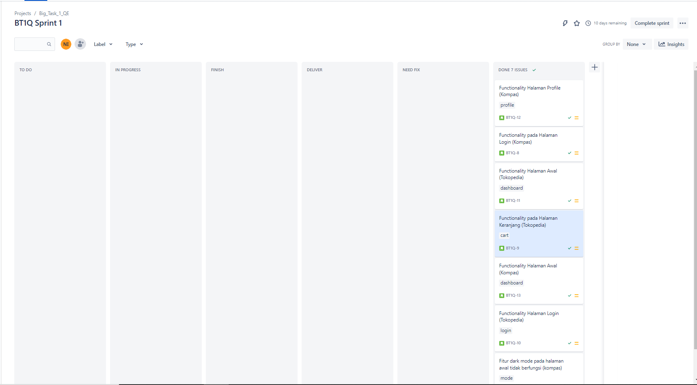

### kembali ke TESTRAIL

16. Melakukan update test case yang berhasil terselesaikan dan melihat report

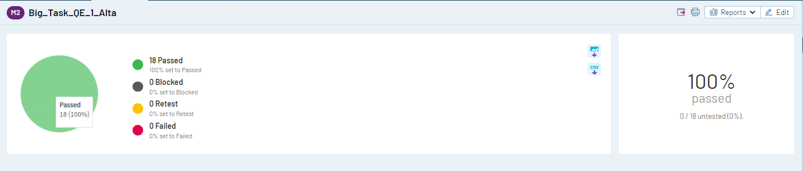

LINK DOCS : [DOCS](https://docs.google.com/document/d/1NkgZ0IWkmX-nz3yCBVhDtnyn9pn7ap7ABy06itnUVbU/edit?usp=sharing)

LINK JIRA : [JIRA](https://nmihsanuddien.atlassian.net/jira/software/projects/BT1Q/boards/2)

LINK TESTRAIL : [TESTRAIL](https://nmihsanuddien.testrail.io/index.php?/projects/overview/3)